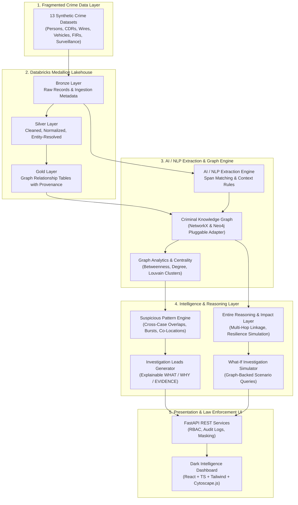

# CrimeGraph AI

> **From fragmented crime data to connected investigative intelligence.**

CrimeGraph AI is a production-quality criminal network analysis and investigation-support platform. It processes fragmented crime records across Databricks Lakehouse Medallion architecture (Bronze → Silver → Gold), extracts structured entities and relationships via AI/NLP with strict provenance, models a multi-modal Criminal Knowledge Graph, detects suspicious patterns, generates explainable investigation leads, and empowers investigators with a graph-backed What-If Investigation Simulator and Entire reasoning integration.

---

## 1. System Architecture



---

## 2. Key Features

- **Databricks Medallion Lakehouse:** Bronze (raw payloads), Silver (normalized phones, validated entities), and Gold (`criminal_network_gold`, `communication_relationships_gold`, `financial_relationships_gold`, `location_relationships_gold`).
- **AI / NLP Extraction Engine:** High-precision Named Entity Recognition (PERSON, PHONE, VEHICLE, LOCATION, ORGANIZATION, BANK_ACCOUNT, CASE_ID) and Relationship Extraction (CONTACTED, USED, VISITED, TRANSFERRED_TO, WORKED_WITH, OWNED).
- **Criminal Knowledge Graph:** Multi-modal graph with pluggable adapter interface (`LocalNetworkXAdapter` with 0-config local execution and `Neo4jAdapter`).
- **Graph Analytics & Bridge Discovery:** Calculates Degree, Betweenness Centrality, PageRank, and Louvain modularity communities to uncover hidden topological bridge individuals (e.g. `P017` / Priya Sharma).
- **Suspicious Pattern Engine:** Scans graph topology for Cross-Case Connections, Burner Phone Swaps, Tactical Co-Locations (e.g. `LOC-004` / Warehouse 4), and Layered Financial Conduits (`ACC-9921` → `ACC-2005`).
- **Actionable Investigation Leads:** Generates human-reviewable leads formatted with **WHAT**, **WHY IT MATTERS**, **EVIDENCE CHAIN**, **CONFIDENCE SCORE**, and **RECOMMENDED ACTION**.
- **Evidence Explorer & Chain of Custody:** Cryptographically traceable provenance linking every relationship edge back to raw CDR records, wire transfers, field surveillance notes, and FIR narratives.
- **Entire Integration Layer:**
  - `RelationshipReasoningEngine`: Multi-hop explanation connecting disparate cases.
  - `ImpactAnalysisEngine`: Simulates network damage and cluster fragmentation upon node removal.
  - `EvidenceTraceEngine`: Resolves full forensic custody chains.
- **What-If Investigation Simulator:** Natural language graph scenario workbench answering questions like *"What entities connect FIR-1024 and FIR-1098?"* or *"What happens if P017 is removed from the network?"*.
- **Security & RBAC:** Data masking (`98765*****10`), Role Switcher (Investigator, Analyst, Administrator), and Immutable Audit Trail.

---

## 3. Technology Stack

- **Frontend:** React 19, TypeScript, Vite, Tailwind CSS, Cytoscape.js, Recharts, Lucide Icons.
- **Backend:** Python 3.11+, FastAPI, Pydantic v2, NetworkX, Uvicorn, Pytest.
- **Data / Lakehouse:** Databricks Lakehouse Delta tables, PySpark notebook, Local Medallion engine.
- **Graph Database:** Neo4j (Cypher ready) + In-memory NetworkX MultiDiGraph adapter.

---

## 4. Demo Walkthrough: Primary Investigative Workflow

1. **Open CrimeGraph AI:** Dashboard displays 25 cases, 59 persons analyzed, 4 investigation leads, and high-betweenness bridge entities.
2. **Select Case FIR-1024 (Gold Smuggling):** Navigate to *Case Investigation* and view FIR report, extracted entities, and initial case network.
3. **Click "Analyze Network":** Watch the live pipeline execute:
   - Bronze ingestion parsed
   - NLP extracts entities (`Ravi Kumar`, `Arjun Singh`, `Priya Sharma`, `Warehouse 4`)
   - Gold relationship tables populated
   - Centrality metrics computed
   - Hidden bridge individual `P017` (Priya Sharma) discovered linking `FIR-1024` to `FIR-1098` (Cyber Extortion).
4. **Inspect Investigation Lead:** Review Lead `LEAD-2026-001` (*Potential Bridge Individual Linking Disjoint Syndicates*):
   - **Why it matters:** Highest betweenness centrality score connecting gold smuggling to cyber extortion.
   - **Evidence chain:** CDR Intercept `C-020`, Bank wire `TX-004` (Rs 24,00,000), Surveillance log `SURV-002`.
5. **Open Evidence Explorer:** Inspect raw payloads and verified forensic chain of custody with data masking toggle.
6. **Open What-If Simulator:** Ask *"What entities connect FIR-1024 and FIR-1098?"*:
   - Graph queries shortest Dijkstra path: `Ravi (P001) -> Priya (P017) -> Phone (PH-9876) -> Sameer (P023) -> Zenith Global (ORG-005)`.
   - Visual graph path highlights the connecting hops with 94% confidence.
7. **Simulate Resilience Disruption:** Ask *"What happens if P017 is removed from the network?"*:
   - System calculates network fragmentation into 2 disconnected clusters and 4 severed operational edges.

---

## 5. Quickstart & Local Installation

### Prerequisites
- Python 3.11+
- Node.js v18+ and npm

### 1. Backend Setup
```powershell
# Navigate to workspace root
cd d:\SIH

# Generate synthetic dataset (13 CSVs)
python data\synthetic\generate_synthetic_data.py

# Run Databricks Lakehouse Medallion Pipeline
python databricks\lakehouse_engine.py

# Run backend test suite
python -m pytest tests -v

# Start FastAPI backend server
python -m uvicorn backend.app.main:app --host 127.0.0.1 --port 8000 --reload
```

Backend will be operational at `http://127.0.0.1:8000` (Swagger UI at `/docs`).

### 2. Frontend Setup
```powershell
# Navigate to frontend directory
cd d:\SIH\frontend

# Install dependencies
npm install

# Start development server
npm run dev
```

Frontend will be accessible at `http://localhost:5173`.

---

## 6. Responsible AI Principles

CrimeGraph AI is strictly an **investigation-support system**. It **never** asserts guilt, labels individuals as "criminals", or recommends punitive actions. All findings are labeled as *Investigative Leads*, *Potential Relationships*, or *High-Connectivity Entities* requiring authorized human review.

